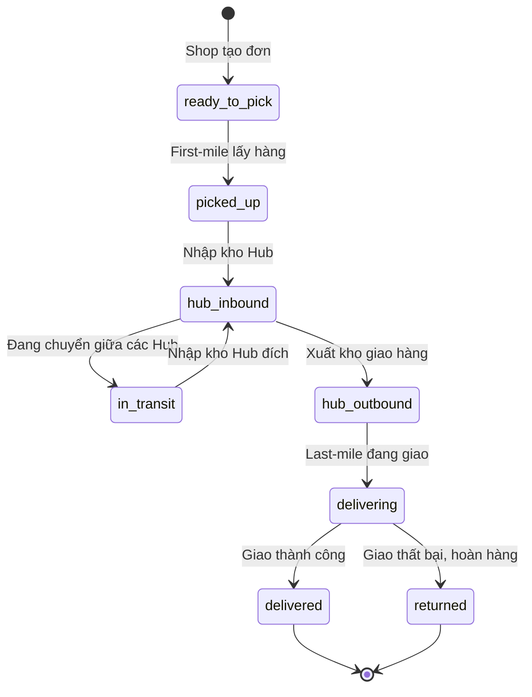

# Sơ đồ Chuyển Trạng thái (State Machine)

Hệ thống quản lý trạng thái của `shipping_orders` một cách nghiêm ngặt. Trạng thái chỉ được chuyển theo một luồng nhất định.

## Luồng Trạng thái Cơ bản

## Các Ràng buộc (Constraints)
1. **Từ `ready_to_pick` sang `picked_up`**: Chỉ Driver (Role: `first_mile`) hoặc Admin mới được phép thực hiện.
2. **`hub_inbound` và `hub_outbound`**: Bắt buộc phải có quét mã bởi Hub Staff tại khu vực phân loại hàng hóa. 
3. **`delivering`**: Đơn hàng phải ở trạng thái `hub_outbound` trước đó, và chỉ `last_mile` driver được gán đơn mới được phép cập nhật.
4. **Hành động không hợp lệ**: Không thể chuyển thẳng từ `ready_to_pick` sang `delivered` mà không qua Hub, nhằm đảm bảo quản lý chặt chẽ rủi ro mất mát hàng hóa.
